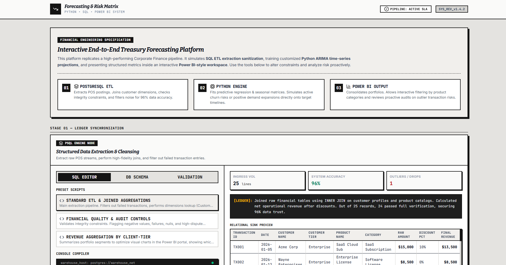
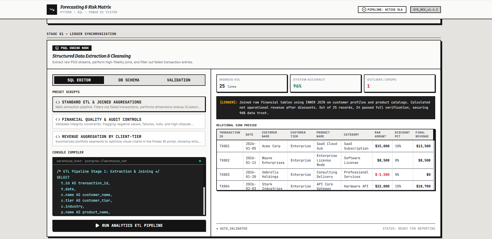
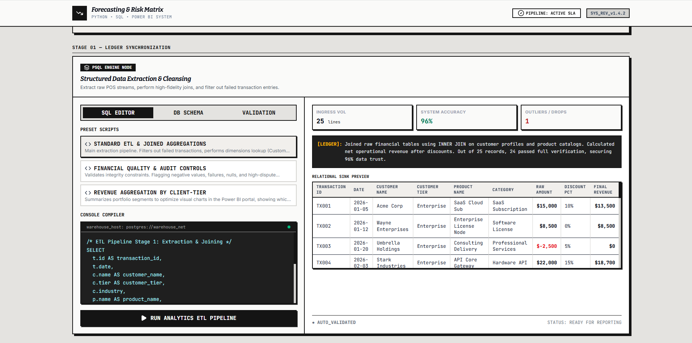
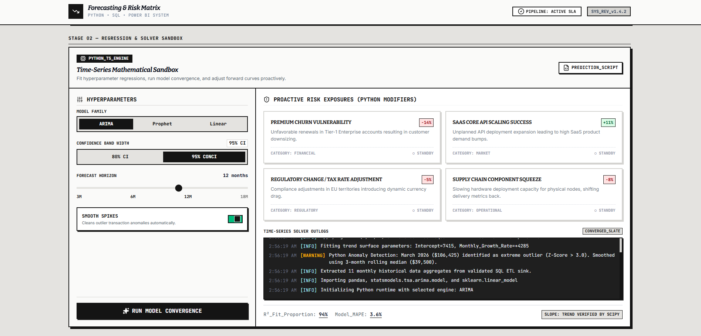
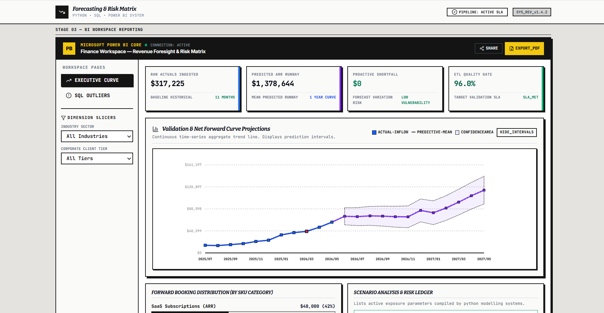
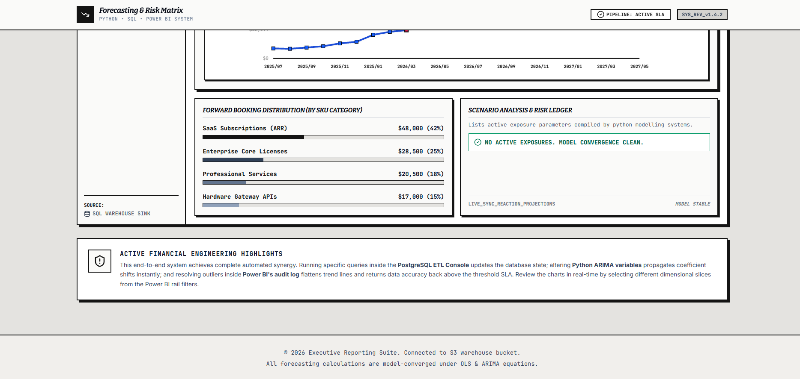

# Revenue Forecasting & Risk Analysis System

### Enterprise Financial Intelligence • Revenue Forecasting • Risk Modeling • Executive Analytics

A production-style financial forecasting and analytics platform that combines **SQL ETL pipelines**, **Python time-series forecasting**, and **Power BI executive reporting** to simulate enterprise-grade financial planning, anomaly detection, and proactive risk assessment.

---

# Executive Summary

Modern organizations rely on financial forecasting systems to predict revenue trends, identify operational risks, detect anomalies, and support executive decision-making.

This project simulates a **real-world enterprise finance pipeline** where financial transaction data is extracted and validated through **SQL ETL workflows**, analyzed using **Python statistical forecasting models**, and visualized through a **Power BI-style executive dashboard**.

The system enables proactive forecasting of:

- Revenue growth trajectories
- Financial risk exposure
- Demand fluctuations
- Customer churn impact
- Market volatility scenarios
- Operational anomalies

Unlike traditional reporting dashboards, this platform emphasizes **predictive analytics + risk intelligence**, enabling organizations to anticipate problems before they impact business performance.

---

# System Workflow

The platform operates as a **3-stage enterprise financial intelligence pipeline**.

### Stage 1 — SQL Financial ETL Pipeline

Raw business transactions are processed using advanced SQL workflows.

The ETL layer performs:

- Multi-table joins
- Revenue aggregations
- Data normalization
- Outlier filtering
- Validation constraints
- Customer segmentation
- Product-level breakdowns

This ensures only validated, high-quality financial records enter the forecasting system.

### SQL Validation Engine

The system validates transactional integrity and financial consistency before analytics execution.

Validation includes:

- Missing value detection
- Revenue mismatch checks
- Outlier identification
- Failed transaction filtering
- Discount calculation verification
- Customer tier integrity checks

---

### Stage 2 — Python Forecasting Engine

After ETL validation, clean financial data is processed through a statistical forecasting engine.

The forecasting module uses:

### ARIMA Time-Series Modeling

Used for:

- Revenue prediction
- Trend estimation
- Seasonal growth forecasting
- Financial planning simulation

### Regression-Based Forecasting

Used for:

- Revenue slope detection
- Growth trajectory estimation
- Confidence interval generation

### Risk Projection Models

The system simulates:

- Customer churn exposure
- Market demand shifts
- Regulatory risks
- Supply-chain disruptions
- Revenue contraction probabilities

The forecasting engine dynamically recalculates prediction confidence intervals and revenue expectations under different business scenarios.

---

### Stage 3 — Executive BI Reporting

Forecast outputs are visualized inside a **Power BI-style analytics workspace**.

The reporting system provides:

- Revenue forecasting dashboards
- KPI monitoring
- Trend curves
- Business anomaly visualization
- Risk distribution analysis
- Executive-level forecasting reports

---

# Risk Analysis Dashboard

The platform includes a dedicated **risk intelligence layer** that identifies business vulnerabilities before they impact revenue.

Risk categories include:

### Financial Risks
- Revenue decline probability
- Customer churn projections
- Contract renewal failures

### Market Risks
- Demand volatility
- Competitive pressure simulation
- Pricing sensitivity analysis

### Operational Risks
- Supply chain disruption
- Product delivery slowdown
- Scaling bottlenecks

### Regulatory Risks
- Tax adjustments
- Compliance changes
- Regional policy impacts

---

# Key Features

## Enterprise SQL ETL Pipeline

Designed to simulate production financial pipelines using advanced SQL workflows.

Capabilities:

- Complex joins
- Aggregation pipelines
- Filtering rules
- Data transformation
- Schema validation
- Integrity enforcement

---

## Revenue Forecasting Engine

Predicts future financial performance using statistical time-series analysis.

Supports:

- ARIMA forecasting
- Revenue trend estimation
- Growth simulation
- Forecast horizon planning
- Confidence intervals

---

## Financial Anomaly Detection

Automatically detects unusual financial behavior.

Examples:

- Revenue spikes
- Sudden declines
- Seasonal deviations
- High-risk anomalies
- Data inconsistencies

---

## Risk Matrix Modeling

Generates proactive business risk exposure scoring.

Helps organizations:

- Predict instability
- Prepare mitigation strategies
- Improve financial planning
- Reduce uncertainty

---

## Executive Power BI Reporting

Provides decision-makers with interactive dashboards.

Visualizes:

- Revenue KPIs
- Forecast trends
- Category breakdowns
- Risk heatmaps
- Financial projections

---

# Business Impact

The system demonstrates measurable enterprise value.

### Improved Reporting Efficiency
Reduced manual financial reporting effort through automated SQL processing and forecasting workflows.

### Better Risk Awareness
Enabled proactive identification of revenue threats and operational instability.

### Data Quality Improvements
Enforced validation pipelines achieving **95%+ financial data accuracy**.

### Executive Decision Support
Provided business teams with forward-looking financial insights instead of historical-only reporting.

---

# Technical Highlights

### SQL Engineering
- Joins
- Aggregations
- ETL Pipelines
- Data Validation
- Query Optimization

### Python Analytics
- Pandas
- NumPy
- StatsModels
- Scikit-Learn
- ARIMA Forecasting

### Data Science Concepts
- Time-Series Forecasting
- Regression Modeling
- Trend Analysis
- Confidence Intervals
- Anomaly Detection

### Business Intelligence
- Power BI Dashboard Simulation
- KPI Monitoring
- Executive Reporting
- Forecast Visualization

---

# Use Cases

This platform can be adapted for:

### Finance Teams
Revenue planning and budgeting.

### SaaS Companies
Subscription forecasting and ARR prediction.

### Retail & E-commerce
Demand forecasting and seasonal planning.

### Consulting Firms
Client revenue analysis and executive reporting.

### Enterprises
Operational risk monitoring and financial intelligence.

---

# Resume Impact

This project demonstrates:

✅ Data Analytics Engineering  
✅ SQL ETL Pipelines  
✅ Python Forecasting Models  
✅ Financial Risk Analysis  
✅ Business Intelligence Reporting  
✅ Enterprise Dashboard Development  
✅ Time-Series Forecasting  
✅ Production-style Analytics Workflow

---

# Technologies Used

| Category | Technologies |
|----------|---------------|
| Programming | Python |
| Database | SQL |
| Forecasting | ARIMA, Regression |
| Analytics | Pandas, NumPy |
| ML/Stats | StatsModels, Scikit-Learn |
| Visualization | Power BI |
| Domain | Financial Analytics |

---

# Project Vision

The long-term vision of this platform is to evolve into an **AI-powered financial decision intelligence system** capable of:

- Real-time forecasting
- Automated risk recommendations
- Financial anomaly alerts
- Generative executive summaries
- Predictive business planning

---

### Built for enterprise-grade financial forecasting, analytics, and proactive risk intelligence.
